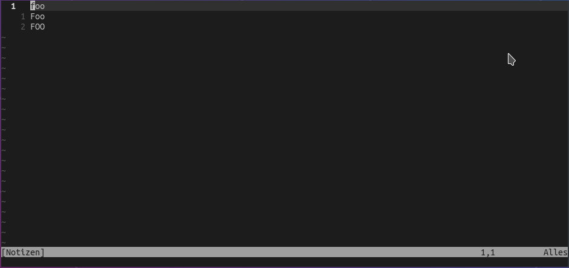

# nvim-keepcase

Simple search and replace while preserving the original case

<div align=center>
  
</div>

## Features

The plugin provides the user command `:Replace` which acts as a drop-in replacement for the builtin `:substitute` command.

## Usage

```
:%Replace/old-word/new-word/g
```

or

```
:%R/old-word/new-word/g
```

## Installation

Install using your favorite package manager, or use the built-in package support

```bash
mkdir -p $HOME/.config/nvim/pack/vendor/start
cd $HOME/.config/nvim/pack/vendor/start
git clone https://github.com/Async10/nvim-keepcase
```
